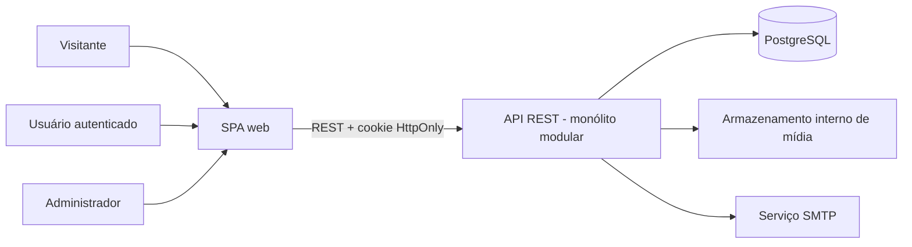
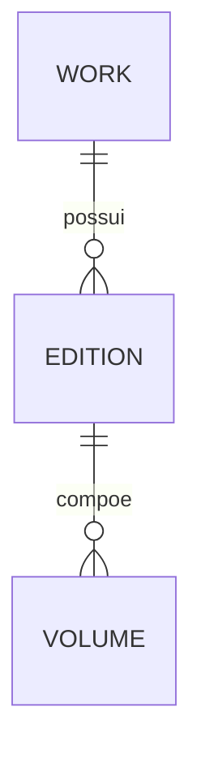
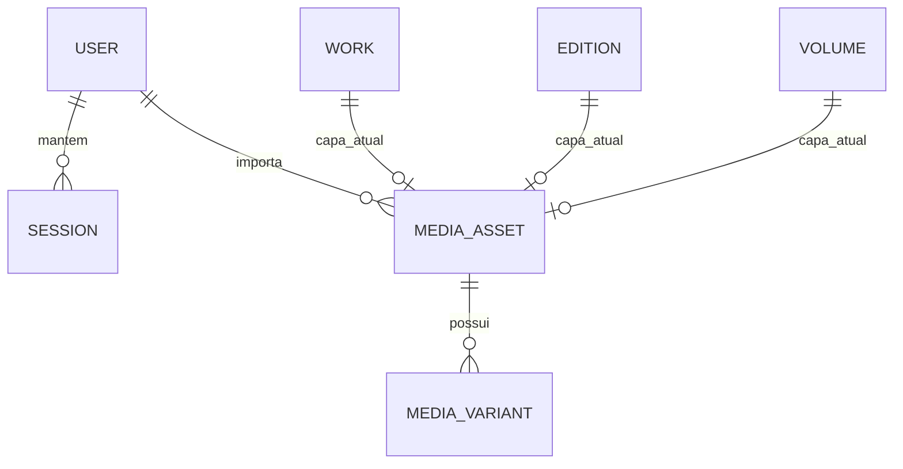

# Modelo Textual dos Diagramas do CoMangá

Este arquivo é a representação textual dos diagramas do CoMangá para leitura, revisão e manutenção por IA. Ele complementa os diagramas visuais; não substitui os arquivos gráficos nem antecipa a atualização manual deles.

## Convenções de status

- `[IMPLEMENTADO]`: existe no código e/ou no schema atual.
- `[REGRA APROVADA]`: comportamento definido no SERS, ainda que a implementação esteja pendente.
- `[PLANEJADO]`: funcionalidade ou estrutura prevista para evolução.
- `[FUTURO]`: direção arquitetural, não presente no sistema atual.

## Arquitetura atual

```text
Visitante / Usuário autenticado / Administrador
                    |
                    v
[IMPLEMENTADO] SPA web
  - rotas públicas, autenticação, perfil e administração
  - navegação e validações para experiência de uso
                    |
                    | HTTPS, requisições REST e cookie HttpOnly
                    v
[IMPLEMENTADO] API REST em monólito modular
  - rotas -> middlewares -> validação -> módulos/controladores -> Prisma
  - autoridade para regras de negócio, sessão, permissão e visibilidade
                    |
         +----------+----------+
         |                     |
         v                     v
[IMPLEMENTADO] PostgreSQL   [IMPLEMENTADO] Serviços externos
  - usuários e sessões        - armazenamento interno de capas
  - catálogo e opções          - SMTP para mensagens de conta
  - metadados de mídia
```



### Limites arquiteturais

- `[IMPLEMENTADO]` O frontend e backend são aplicações separadas, mas o backend é um único monólito modular, não um conjunto de microsserviços.
- `[IMPLEMENTADO]` A sessão é stateful: o cookie contém um identificador opaco; o banco armazena apenas seu hash.
- `[IMPLEMENTADO]` O frontend nunca acessa o banco ou os segredos dos provedores externos diretamente.
- `[FUTURO]` Filas, comunicação por eventos, múltiplas instâncias, replicação e failover podem ser adotados gradualmente. Não devem aparecer como componentes atuais.

## Atores e casos de uso

```text
Visitante
  -> consultar catálogo público, Obras, Edições, Volumes e Obras por Autor
  -> pesquisar, filtrar e navegar
  -> cadastrar conta, ativar conta, entrar e solicitar recuperação de senha

Usuário autenticado
  -> tudo que o Visitante pode fazer
  -> encerrar sessão, consultar e administrar o próprio perfil
  -> [PLANEJADO] organizar Estante Digital e Lista de Desejos
  -> [PLANEJADO] consultar calendário e receber enriquecimento pessoal no catálogo

Administrador
  -> tudo que o Usuário autenticado pode fazer
  -> administrar usuários e opções de domínio
  -> cadastrar, alterar, consultar e publicar Obras, Edições e Volumes
  -> importar e substituir capas internas por URL HTTPS
```

## Modelo de domínio e dados

### Hierarquia principal do catálogo

```text
Obra 1 ----- 0..N Edição 1 ----- 0..N Volume

Cada Edição pertence a exatamente uma Obra.
Cada Volume pertence a exatamente uma Edição.
Uma Obra pode ainda não possuir Edições; uma Edição pode ainda não possuir Volumes.
```



Entidades e atributos principais:

```text
[IMPLEMENTADO] Usuário
  id, nome de usuário, e-mail, hash de senha, status, nível de acesso,
  token e expiração de ativação, preferência de conteúdo adulto, criado em
  [REGRA APROVADA] data de nascimento privada, obrigatória e não futura

[IMPLEMENTADO] Sessão
  id, usuário, hash do token de sessão, último uso, revogada em, criada em

[IMPLEMENTADO] Obra
  id, slug, título em português, título original, país, tipo, status original,
  anos de publicação, total original de volumes, lançamento direto,
  visibilidade, indicador de conteúdo adulto e capa interna

[IMPLEMENTADO] Edição
  id, obra, editora brasileira, tipo, acabamento, formato,
  número cronológico, status de publicação no Brasil, visibilidade e capa interna

[IMPLEMENTADO] Volume
  id, edição, número, volume único, páginas, preço, moeda, precisão e data de lançamento,
  ISBN-10, ISBN-13, link afiliado, sinopse, visibilidade e capa interna
```

### Classificações e relações da Obra

```text
Obra 1 ----- 1..N Vínculo de Autoria ----- 1 Autor
Vínculo de Autoria 1 ----- 1..N Papel de Autoria

Obra 1 ----- 1..N Gênero
Obra 1 ----- 0..N Demografia
Obra 1 ----- 1..N Editora Original, com posição definida
Obra 1 ----- 0..N Revista de Pré-publicação, com posição definida
```

No schema atual, Autor, Gênero, Editora, Tipo de Obra, Tipo de Edição, Acabamento, Formato e Revista de Pré-publicação utilizam valores de domínio administrativos. Para leitura conceitual, estes valores são apresentados pelo significado de negócio, e não pela estrutura genérica `DomainOptionCategory` / `DomainOptionValue`.

```text
[IMPLEMENTADO] Categoria de Opção de Domínio 1 ----- 0..N Valor de Opção de Domínio
[IMPLEMENTADO] Valor de Opção de Domínio pode participar das classificações de Obras e Edições.
[IMPLEMENTADO] Valor de Opção de Domínio pode depender de outro Valor de Opção.
```

### Autoria

```text
[IMPLEMENTADO] WorkAuthor representa o vínculo entre Obra e Autor.
[IMPLEMENTADO] WorkAuthorRole representa um ou mais papéis no vínculo de autoria.

Motivo: um Autor pode ter mais de um papel na mesma Obra.
Exemplo conceitual: uma mesma pessoa pode ser Autor e Ilustrador de uma Obra.
```

Na representação conceitual/MER, a leitura equivalente é:

```text
Obra --< Autoria >-- Autor
                 |
                 +-- um ou mais Papéis de Autoria
```

### Mídia e capas

```text
[IMPLEMENTADO] Ativo de Mídia
  id, provedor, chave interna, URL de procedência restrita, tipo MIME, formato,
  largura, altura, tamanho, checksum, status, criador e datas

[IMPLEMENTADO] Variante de Mídia
  id, ativo de mídia, tipo da variante, chave interna, tipo MIME, dimensões e tamanho

Ativo de Mídia 1 ----- 0..N Variante de Mídia
Usuário administrador 1 ----- 0..N Ativo de Mídia criado/importado
```

```text
[IMPLEMENTADO] Atualmente, Obra, Edição e Volume possuem associação opcional com um Ativo de Mídia.

[REGRA APROVADA] No estado desejado, cada Obra, Edição e Volume deve possuir exatamente uma capa interna válida.
  - Cadastro: exige capa válida.
  - Alteração parcial: preserva a capa atual se não houver substituta.
  - Remoção: é proibida sem associação bem-sucedida de substituta válida.
  - Fallback: somente para indisponibilidade temporária de mídia já associada;
    nunca para registro sem capa.
  - Uma capa ativa deve referenciar exatamente um entre Obra, Edição e Volume.
```



### Acervo pessoal

```text
[PLANEJADO] Item de Estante / Posse de Volume
  usuário, volume, adicionado em, lido

Usuário 1 ----- 0..N Item de Estante 0..N ----- 1 Volume

Regras:
  - a unicidade é por usuário + volume;
  - lido/não lido é atributo do vínculo de posse, não uma entidade independente;
  - o estado inicial é não lido;
  - só é possível marcar como lido Volume que já está na Estante;
  - remover a posse remove o estado de leitura junto.

[PLANEJADO] Item de Lista de Desejos
  usuário, volume, adicionado em

Usuário 1 ----- 0..N Item de Lista de Desejos 0..N ----- 1 Volume

Regras:
  - a unicidade é por usuário + volume;
  - Lista de Desejos não possui estado de leitura;
  - um Volume possuído não pode permanecer na Lista de Desejos.
```

### Calendário

```text
[PLANEJADO] Calendário de lançamentos não é entidade persistida.

Ele é uma consulta derivada dos Volumes públicos e de suas datas de lançamento.
Volumes cuja precisão de data não permite identificar o mês não devem ser atribuídos
arbitrariamente a um mês do calendário.
```

## Fluxos críticos

### Cadastro, ativação e sessão

```text
1. Visitante envia nome de usuário, e-mail, data de nascimento, senha e confirmação.
2. API valida dados, unicidade, data válida/não futura e regra de senha.
3. API cria Usuário com status Pendente e preferência +18 desativada.
4. API gera token de ativação e envia o link por SMTP.
5. Usuário abre o link; a API valida token e expiração, ativa a conta e invalida o token.
6. No login, a API valida senha e status, cria Sessão e devolve cookie HttpOnly.
7. Em toda rota protegida, middleware valida a Sessão no servidor.
```

### Recuperação de senha

```text
[PLANEJADO]
1. Usuário solicita recuperação com o e-mail.
2. API gera token seguro, com expiração, e envia link por SMTP.
3. Usuário informa nova senha e confirmação pelo link.
4. API valida token e senha, atualiza o hash da senha e invalida o token.
5. API revoga as sessões ativas da conta.

A estrutura concreta de persistência do token de redefinição ainda será criada.
Ela não deve reutilizar o token de ativação.
```

### Conteúdo adulto

```text
1. A data de nascimento é privada e não aparece no catálogo público.
2. A preferência +18 nasce desativada.
3. Quando o usuário tenta ativá-la, o backend calcula idade completa na data da solicitação.
4. Se possuir menos de 18 anos, a API recusa a ativação.
5. Visitantes, usuários com a preferência desativada e menores de idade recebem conteúdo adulto omitido.
6. A área administrativa não aplica essa omissão de catálogo.
```

### Importação e associação de capa

```text
1. Administrador autenticado informa uma URL HTTPS.
2. API valida origem, rede de destino, redirecionamentos, tipo de arquivo, tempo, tamanho e pixels.
3. API baixa e processa a imagem, cria variantes e armazena os objetos internamente.
4. Em transação, API associa a referência interna à Obra, Edição ou Volume.
5. Apenas após sucesso completo a nova capa substitui a anterior.
6. Falhas preservam a associação anterior e não expõem a URL externa como capa pública.
```

## Restrições de visibilidade e segurança

```text
Público:
  - somente Obra, Edição e Volume públicos;
  - registros privados são omitidos inclusive por URL direta;
  - conteúdo adulto segue a regra de maioridade e preferência.

Área pessoal:
  - exige sessão stateful válida;
  - só opera sobre o usuário obtido da sessão;
  - vínculos pessoais de registros que se tornarem privados são omitidos, não apagados automaticamente.

Administração:
  - exige Usuário com nível de acesso Administrador;
  - autorização é aplicada no backend antes da regra de negócio e da transação;
  - importação de capa é exclusiva de administrador autenticado.
```

## Relação entre esta representação e os futuros diagramas visuais

| Diagrama visual a manter | Fonte textual deste arquivo |
| --- | --- |
| Arquitetura básica | Arquitetura atual, limites arquiteturais e fluxos críticos. |
| Casos de uso | Atores e casos de uso. |
| Diagrama de sequência | Fluxos críticos. |
| MER conceitual | Modelo de domínio, autoria, mídia, acervo pessoal e calendário. |
| DER físico | Modelo de domínio e entidades `[IMPLEMENTADO]`; o schema Prisma permanece a referência física imediata. |
| Diagrama de classes/ORM | Entidades implementadas, relações e campos de planejamento descritos acima. |

Ao atualizar um diagrama visual, preservar sempre a distinção entre o monólito modular atual e a evolução distribuída futura, bem como entre estruturas implementadas e planejadas.
