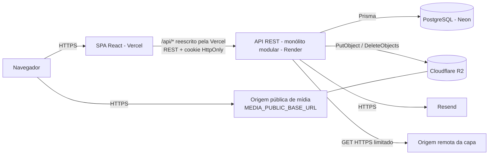
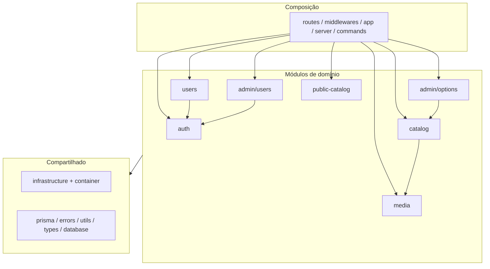
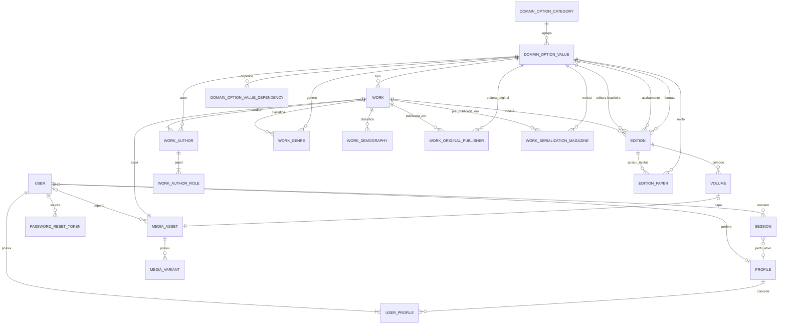

# Modelo Textual dos Diagramas do CoMangá

Este arquivo é a fonte textual dos diagramas do CoMangá. Ele descreve, em formato legível por pessoas e por IA, a arquitetura, o domínio, os fluxos e as rotas do sistema implementado, e serve de referência para regenerar os diagramas visuais desta pasta. Quando um diagrama visual divergir deste texto, vale este texto; quando este texto divergir do código, vale o código (schema Prisma, rotas e testes dos repositórios `comanga-api` e `comanga-web`).

O estado de cada diagrama visual e o que precisa mudar em cada um estão no [README desta pasta](./README.md).

## Convenções de status

- `[IMPLEMENTADO]`: existe no código, no schema ou nas rotas atuais.
- `[PROTÓTIPO DE INTERFACE]`: tela existente na Web, sem integração com a API e sem persistência.
- `[PLANEJADO]`: requisito aprovado no SERS, ainda sem implementação.
- `[FUTURO]`: direção arquitetural possível, fora do sistema atual. Não deve aparecer como componente existente.

Itens removidos do domínio (não desenhar):

- tipo de edição (campo `editions.edition_type_id` e a lista administrativa `tipos-edicao`, eliminados junto com seus valores);
- quantidade de volumes originais da Obra (`works.original_volume_count`);
- capa própria da Edição (a capa exibida é derivada do Volume 1);
- SMTP/Nodemailer (o envio de e-mail usa a API HTTP do Resend);
- Cloudinary (foi apenas prova de conceito; o armazenamento ativo é o Cloudflare R2).

## Arquitetura de implantação

```text
Navegador (Visitante ou conta autenticada)
   |
   | HTTPS
   v
[IMPLEMENTADO] SPA React (comanga-web) hospedada na Vercel
   - rotas do navegador (React Router) e proteções de rota por sessão e perfil ativo
   - a Vercel reescreve /api/* para a API na Render (mesma origem para o navegador)
   |
   | HTTPS, REST/JSON, cookie de sessão HttpOnly
   v
[IMPLEMENTADO] API REST (comanga-api) na Render — monólito modular Node.js/Express/TypeScript
   - autoridade sobre sessão, perfis, autorização, visibilidade, conteúdo adulto e regras do catálogo
   |
   +--> [IMPLEMENTADO] PostgreSQL no Neon (via Prisma ORM)
   |       usuários, perfis, sessões, tokens de redefinição, catálogo, opções e metadados de mídia
   |
   +--> [IMPLEMENTADO] Cloudflare R2 (API compatível com S3)
   |       objetos WebP das capas (original processado e variantes)
   |
   +--> [IMPLEMENTADO] Resend (API HTTP)
   |       e-mails de ativação de conta e de redefinição de senha
   |
   +--> [IMPLEMENTADO] Origem remota HTTPS pública informada pelo Administrador
           somente leitura, durante a importação de uma capa

Navegador --HTTPS--> origem pública de mídia (MEDIA_PUBLIC_BASE_URL) para carregar as imagens das capas
```



Limites arquiteturais:

- `[IMPLEMENTADO]` Web e API são aplicações e repositórios separados. A API é um único processo (monólito modular), não um conjunto de microsserviços.
- `[IMPLEMENTADO]` A sessão é stateful: o cookie carrega um identificador opaco; o banco guarda apenas o hash SHA-256 desse identificador.
- `[IMPLEMENTADO]` A Web nunca acessa o banco, o R2 nem o Resend diretamente. Ela só lê imagens públicas pela URL de mídia devolvida pela API.
- `[IMPLEMENTADO]` Os limitadores de tentativa (login, recuperação e troca de senha) guardam o estado na memória do processo da API.
- `[FUTURO]` Filas, eventos, múltiplas instâncias da API, armazenamento compartilhado de rate limiting, réplicas e failover. Não desenhar como componentes atuais.

## Estrutura interna da API

```text
Composição (src/routes, src/middlewares, src/app.ts, src/server.ts, src/commands)
   |  só pode importar a entrada pública (index.ts) de cada módulo
   v
Módulos de domínio (src/modules)
   auth            sessão, login/logout, cadastro, ativação, recuperação de senha,
                   perfis de acesso, autorização por perfil ativo, limitadores de tentativa
   users           conta própria: dados, preferência +18, perfil ativo, nome de usuário,
                   senha, exclusão da conta                          -> depende de auth
   admin/users     listagem de contas e concessão/remoção do perfil Administrador
                                                                     -> depende de auth
   admin/options   "Gerenciar opções" e opções dos formulários        -> depende de catalog
   catalog         Obras, Edições e Volumes na administração          -> depende de media
   media           importação, ciclo de vida e limpeza de capas
   public-catalog  catálogo público e política de conteúdo adulto
   |
   v
Compartilhado (src/infrastructure, src/prisma.ts, src/database, src/errors, src/utils, src/types)
   infrastructure/container.ts   instancia e-mail, R2, download e processamento de capas
   infrastructure/contracts      MailService, MediaStorage, RateLimitStore
   infrastructure/mail           ResendMailService
   infrastructure/media          R2MediaStorage, RemoteImageDownloader, CoverImageProcessor, mediaPublicUrl
   infrastructure/rate-limit     MemoryRateLimitStore
   infrastructure/logging        logger JSON estruturado
   infrastructure/operations     /health/live, /health/ready, /health/metrics e desligamento gracioso
   infrastructure/database       parâmetros de pool da conexão Prisma
```



Regras verificadas pelo teste de arquitetura (`npm run test:architecture`): um módulo só importa outro pela entrada pública `index.ts` e apenas na direção declarada acima; o código compartilhado não importa módulos; não há ciclos de importação, `require` nem import dinâmico com caminho calculado; arquivos fora das categorias conhecidas são recusados.

## Estrutura interna da Web

```text
Composição: src/App.tsx, src/main.tsx, src/app (GuestRoute, ProtectedRoute, PublicProfileRoute, PublicNav, NotFound)
Features (src/features):
   auth            contexto de autenticação, login, cadastro, ativação, reenvio, recuperação e redefinição
   profile         perfil, troca de perfil ativo, preferência +18, configurações avançadas  -> depende de auth
   admin-users     gestão de contas                                                          -> depende de auth
   admin-catalog   Obras, Edições, Volumes e "Gerenciar opções"                              -> depende de admin-media
   admin-media     campo de importação de capa por URL
   public-catalog  pesquisa, Obra, Edição, Volume, Obras por Autor, seleção de Volumes
   collection      [PROTÓTIPO DE INTERFACE] Coleção e Checklist ("Em breve")
   wishlist        [PROTÓTIPO DE INTERFACE] Lista de Desejos ("Em breve")
Compartilhado: src/components, src/hooks, src/lib, src/services (cliente Axios), src/test, src/vite-env.d.ts, src/index.css
```

## Atores, perfis e sessão

Conceitos que não devem ser tratados como sinônimos:

| Conceito | Onde fica | Significado |
| --- | --- | --- |
| Perfil concedido | `user_profiles` | Perfis que a conta possui. Toda conta tem Usuário Padrão; o Administrador é concedido por outro Administrador. |
| Perfil preferido | `users.preferred_profile_id` | Perfil com que a próxima sessão começa, se a conta ainda o possuir. É atualizado quando o usuário troca o perfil ativo e quando o perfil Administrador é concedido ou removido. |
| Perfil ativo | `sessions.active_profile_id` | Contexto da sessão atual. Define o que a sessão pode fazer. Trocar o perfil ativo não concede nem remove perfis. |
| Nível de acesso (legado) | `users.nivel_acesso` | Coluna legada. Um gatilho no banco recria os perfis concedidos e o perfil preferido a partir dela quando uma conta é criada ou quando ela muda; o sentido inverso não existe, e a API grava as duas coisas. Não é a fonte da autorização. |
| Papel de autoria | `work_author_roles` | Crédito de um Autor em uma Obra (História, Arte etc.). Não tem relação com perfis de acesso. |

Atores dos casos de uso:

```text
Visitante (sem sessão válida)
  -> [IMPLEMENTADO] pesquisar e filtrar Obras e Edições públicas
  -> [IMPLEMENTADO] consultar Obra, Edição, Volume e Obras por Autor (sem conteúdo adulto)
  -> [IMPLEMENTADO] cadastrar conta, ativar conta, reenviar ativação, entrar,
                    solicitar recuperação e redefinir senha

Conta autenticada com o perfil ativo Usuário Padrão
  -> [IMPLEMENTADO] tudo que o Visitante consulta no catálogo público
  -> [IMPLEMENTADO] ver conteúdo adulto se for maior de idade e tiver a preferência +18 habilitada
  -> [IMPLEMENTADO] consultar perfil, alterar preferência +18, nome de usuário e senha,
                    excluir a conta, encerrar sessão
  -> [IMPLEMENTADO] trocar o perfil ativo para outro perfil concedido à conta
  -> [PROTÓTIPO DE INTERFACE] selecionar Volumes para Estante/Desejos, Coleção, Checklist, Lista de Desejos
  -> [PLANEJADO] Estante Digital, Lista de Desejos e calendário de lançamentos com persistência

Conta autenticada com o perfil ativo Administrador
  -> [IMPLEMENTADO] consultar e alterar o próprio perfil, trocar de perfil, encerrar sessão
  -> [IMPLEMENTADO] listar contas e conceder/remover o perfil Administrador de outra conta
  -> [IMPLEMENTADO] "Gerenciar opções": criar, alterar e excluir valores das listas gerenciáveis
                    (desativar um valor só é possível pela API, por decisão); tipos de obra e gêneros são fixos e não aparecem nessa tela
  -> [IMPLEMENTADO] cadastrar, alterar, consultar, publicar/ocultar e excluir Obras, Edições e Volumes
  -> [IMPLEMENTADO] importar capas por URL HTTPS e descartar capa importada ainda não associada
  -> não acessa as páginas públicas do catálogo na Web: é enviado ao perfil com o aviso
     "Mude o perfil para usuário padrão para acessar essa página."
```

Leituras do catálogo público por uma conta que possui o perfil Administrador concedido: a API libera conteúdo adulto independentemente de idade, preferência e perfil ativo. Como a Web bloqueia as páginas públicas com o perfil Administrador ativo, na prática essa exceção aparece quando a conta navega com o perfil Usuário Padrão ativo.

## Modelo de domínio e dados

### Contas, perfis e sessões

```text
[IMPLEMENTADO] Usuário (users)
  id, nome de usuário (único), e-mail (único), hash da senha (bcrypt),
  status (Pendente, Ativada ou Bloqueada; nenhum fluxo atual bloqueia contas),
  nível de acesso legado, token e expiração de ativação, preferência de conteúdo adulto,
  data de nascimento (privada), perfil preferido, criado em

[IMPLEMENTADO] Perfil (profiles)
  id, código estável (USUARIO_PADRAO, ADMINISTRADOR), nome exibido (Usuário Padrão, Administrador), de sistema

[IMPLEMENTADO] Perfil concedido (user_profiles)
  usuário + perfil (chave composta), criado em

[IMPLEMENTADO] Sessão (sessions)
  id, usuário, hash do token de sessão, perfil ativo, último uso, revogada em, criada em

[IMPLEMENTADO] Token de redefinição de senha (password_reset_tokens)
  id, usuário, hash do token, expira em (1 hora), usado em, criado em

Usuário 1 ----- 1..N Perfil concedido N ----- 1 Perfil
Usuário 0..N ----- 0..1 Perfil (preferido)
Usuário 1 ----- 0..N Sessão 0..N ----- 0..1 Perfil (ativo)
Usuário 1 ----- 0..N Token de redefinição
```

Exclusão da conta remove em cascata perfis concedidos, sessões e tokens de redefinição; as capas criadas pela conta são preservadas e perdem apenas a autoria (`created_by_user_id` passa a nulo).

### Hierarquia do catálogo

```text
Obra 1 ----- 0..N Edição brasileira 1 ----- 0..N Volume

Cada Edição pertence a exatamente uma Obra; cada Volume a exatamente uma Edição.
Exclusões são protegidas: Obra com Edições, Edição com Volumes e registros públicos não são excluídos.
```

```text
[IMPLEMENTADO] Obra (works)
  obrigatórios: slug (derivado do título, único e estável), título, título romanizado, sinopse,
                tipo de obra, país de origem, status da publicação original, capa (Ativo de Mídia exclusivo)
  opcionais:    título original (a Web ainda o exige, SERS 6.3),
                anos de início e fim da publicação original
  controle:     lançamento direto, visibilidade (Privado/Público, nasce Privado),
                conteúdo adulto (forçado a verdadeiro quando há o gênero Hentai)
  relações:     autores com papéis e posição, gêneros, demografias,
                editoras originais com posição, revistas de pré-publicação com posição

[IMPLEMENTADO] Edição (editions) — publicação brasileira
  obrigatórios: Obra, editora brasileira, número da edição (único por Obra), status de publicação no Brasil
  opcionais:    acabamento (tipo de capa) e formato — podem ficar nulos;
               miolos — lista ordenada de 0 a 50 valores distintos em edition_papers, omitida da exibição quando vazia
  controle:     visibilidade (nasce Privado; propagada aos Volumes)
  capa:         não possui capa própria; a capa exibida é a do Volume 1 da mesma Edição
                (no catálogo público, apenas se o Volume 1 for público; sem ele, não há capa)
  publicação:   só pode ficar pública com a Obra pública e com Volume 1 com capa válida

[IMPLEMENTADO] Volume (volumes)
  obrigatórios: Edição, número (único na Edição, pode ser 0), capa (Ativo de Mídia exclusivo),
                data de lançamento com precisão (o ano é sempre exigido)
  opcionais:    volume único, páginas, preço e moeda
                (Completa, Mês e ano, Ano), ISBN-10, ISBN-13, link de afiliado, sinopse
  controle:     visibilidade herdada da Edição
  exibição:     Volumes anterior e seguinte públicos da mesma Edição; miolos são exibidos apenas na Edição
```

Valores fixos no código (não são opções administrativas): países de origem da Obra (Japão, Coreia do Sul, China, Taiwan), demografias (Shonen, Shoujo, Seinen, Josei, Kodomo), status de publicação (Completa, Em andamento, Em hiato, Cancelada), moedas do preço e precisões de data.

A relação `EditionPaper` (`edition_papers`) vincula Edição e valor de miolo, com chave composta (`edition_id`, `paper_id`) e `position`. A exclusão da Edição apaga os vínculos em cascata; a exclusão de um miolo vinculado é restrita. O contrato administrativo usa `paperIds`; consultas retornam `papers` na ordem persistida.

### Opções administrativas e classificações controladas

```text
[IMPLEMENTADO] Categoria de opção (domain_option_categories) 1 ----- 0..N Valor de opção (domain_option_values)
  Valor: rótulo, código, controlado pelo sistema, exclusivo adulto, posição, ativo
[IMPLEMENTADO] Dependência entre valores (domain_option_value_dependencies)
  Usada para vincular autores, tipos de obra, revistas e editoras originais aos países de origem compatíveis.
  Para tipos de obra a dependência de país é obrigatória: combinação tipo/país sem dependência é recusada.
```

| Categoria | Uso | Gestão em "Gerenciar opções" |
| --- | --- | --- |
| `tipos-obra` | Tipo da Obra | Fixa, controlada pelo sistema; sem gestão pelo Administrador. Ordem oficial: Mangá, Manhwa, Manhua, Light Novel, Novel, Artbook, Databook. |
| `generos` | Gêneros da Obra | Fixa, controlada pelo sistema; sem gestão pelo Administrador. Hentai e valores `exclusivo adulto` restringem a Obra. |
| `autores` | Autoria | Gerenciável |
| `editoras-originais` | Editoras originais da Obra | Gerenciável |
| `revistas-serializacao` | Revistas de pré-publicação | Gerenciável |
| `editoras-brasileiras` | Editora da Edição | Gerenciável |
| `tipos-capa` | Acabamento da Edição | Gerenciável |
| `formatos-fisicos` | Formato da Edição | Gerenciável |
| `miolos` | Miolo (papel) da Edição | Gerenciável |
| `paises-origem` | Referência das dependências por país | Somente listagem |

Tipos de obra e gêneros não podem ser criados, renomeados, excluídos nem ter dependências alteradas. Divergência residual: a API ainda aceita alterar o campo `active` deles por `PATCH /api/admin/options/:id` (SERS 6.3).

Regra do Hentai em duas camadas: a API força conteúdo adulto verdadeiro enquanto a Obra tiver Hentai, mesmo que a requisição envie falso; remover o Hentai não desmarca a flag na API, que pode então ser desmarcada explicitamente. No formulário da Web, retirar o Hentai desmarca a opção automaticamente.

### Autoria

```text
[IMPLEMENTADO] Vínculo de autoria (work_authors): Obra + Autor, com posição (0, 1, 2... normalizada pelo backend)
[IMPLEMENTADO] Papel de autoria (work_author_roles): um ou mais papéis por vínculo

Obra 1 ----- 1..N Vínculo de autoria N ----- 1 Autor (valor da categoria autores)
Vínculo de autoria 1 ----- 1..N Papel de autoria

Papéis: História e Arte, História, Arte, Criador Original, História Original, Ilustrador, Design de Personagens.
Ordem de exibição: Criador Original, História Original, História e Arte, História, Arte, Ilustrador,
                   Design de Personagens; empate ordenado pelo nome do Autor.
Restrição: o mesmo Autor não pode ter "História e Arte" junto com "História" ou "Arte",
           nem "História" junto com "Arte" (use "História e Arte").
```

Cardinalidade das demais relações da Obra na API: gêneros, demografias, editoras originais e revistas são 0..N. O formulário da Web exige ao menos um gênero e uma editora original, e exige demografia e revista conforme as regras de publicação da etapa.

### Mídia e capas

```text
[IMPLEMENTADO] Ativo de Mídia (media_assets)
  id, provedor (r2), chave do objeto principal, URL de procedência (restrita, nunca exibida),
  tipo MIME, formato (webp), largura, altura, bytes, checksum SHA-256 da origem,
  status (Pendente, Ativo, Descartando), criado por, criado em, ativado em

[IMPLEMENTADO] Variante de Mídia (media_variants)
  id, ativo, tipo (COVER_SMALL 320x480, COVER_LARGE 640x960), chave do objeto, MIME, dimensões, bytes

Ativo de Mídia 1 ----- 0..N Variante de Mídia (exclusão em cascata)
Obra   0..1 ----- 1 Ativo de Mídia (a Obra exige capa exclusiva; o ativo pode estar Pendente ou pertencer a outro registro)
Volume 0..1 ----- 1 Ativo de Mídia (idem)
Edição: sem associação; capa derivada do Volume 1
Usuário 0..1 ----- 0..N Ativo de Mídia (criado por)
```

Objetos no R2: `covers/<id>/master.webp` (1200x1800), `covers/<id>/small.webp` e `covers/<id>/large.webp`, gravados com cache público imutável. A URL pública é montada a partir de `MEDIA_PUBLIC_BASE_URL` (HTTPS obrigatório) e da chave, preferindo a variante grande.

### Diagrama entidade-relacionamento de referência



Integridade referencial: Obra → Edição → Volume, capas e valores de opção usam `RESTRICT`; sessões, perfis concedidos, tokens de redefinição, vínculos da Obra e variantes de mídia usam `CASCADE`.

### Acervo pessoal e calendário

```text
[PLANEJADO] Item de Estante (posse de Volume): usuário, Volume, adicionado em, lido
[PLANEJADO] Item de Lista de Desejos: usuário, Volume, adicionado em
  - unicidade por usuário + Volume; um Volume possuído não permanece na Lista de Desejos;
  - lido/não lido é atributo da posse e começa como não lido.
[PLANEJADO] Calendário de lançamentos: consulta derivada das datas dos Volumes públicos, sem entidade própria;
  Volumes sem mês conhecido não são atribuídos a um mês arbitrário.
```

Nenhuma dessas estruturas existe no schema. As telas `/colecao`, `/checklist`, `/desejos` e a seleção de Volumes para "estante"/"desejos" são protótipos de interface sem persistência.

## Fluxos críticos

### Cadastro e ativação

```text
1. Visitante envia nome de usuário, e-mail, data de nascimento, senha e confirmação.
2. API valida formato, unicidade, data válida e não futura e a política de senha.
3. API cria a conta Pendente, preferência +18 desativada, perfil Usuário Padrão concedido,
   e um token de ativação válido por 24 horas.
4. API envia o link /activate/<token> pelo Resend. Falha de envio não desfaz o cadastro; o usuário pode reenviar.
5. Ao abrir o link, a API valida token e expiração, ativa a conta e invalida o token.
6. O reenvio gera novo token e invalida o anterior; responde 404 para e-mail não cadastrado.
   Cadastro e reenvio não têm rate limiting.
```

### Login e validação da sessão (fonte do diagrama de sequência)

```text
1. Cliente envia POST /api/auth/login { email, password }.
2. Limitador em memória: após 5 falhas (HTTP 401) do mesmo IP em 5 minutos, responde 429 sem consultar o banco.
3. API busca a conta pelo e-mail e compara a senha com bcrypt.
   - Conta inexistente ou senha incorreta: 401 "Credenciais inválidas!".
   - Conta Pendente ou Bloqueada: 403.
4. Em transação, a API relê a conta com bloqueio de linha, resolve o perfil ativo inicial
   (perfil preferido, se ainda concedido; senão Usuário Padrão) e cria a Sessão com o hash SHA-256
   de um token aleatório.
5. Resposta 200 com Set-Cookie HttpOnly (SameSite=Strict por padrão; Secure em produção)
   e os dados da conta: perfis concedidos e perfil ativo.
6. Em cada rota protegida, o middleware calcula o hash do cookie, exige sessão não revogada
   e conta Ativada, recarrega os perfis concedidos e confirma que o perfil ativo ainda é concedido
   (senão trata a sessão como Usuário Padrão).
7. Rotas administrativas exigem perfil ativo Administrador e a atribuição vigente; caso contrário, 403
   antes de qualquer regra de negócio.
8. A sessão não expira por tempo: não há validade no banco nem Max-Age no cookie, e o último uso não
   encerra a sessão. Ela vale até o logout ou outra revogação.
```

### Troca de perfil ativo e gestão do perfil Administrador

```text
Troca de perfil ativo (PATCH /api/users/me/active-profile):
  exige que o perfil seja concedido à conta; atualiza o perfil ativo da sessão atual e o perfil preferido.

Concessão/remoção do Administrador (PATCH /api/admin/users/:id/role):
  somente sobre outra conta; a própria conta é recusada; a remoção do último Administrador ativo é recusada.
  Ao remover, sessões da conta que estavam com o perfil Administrador ativo passam para Usuário Padrão.
```

### Recuperação, alteração de senha e exclusão de conta

```text
Recuperação (POST /api/auth/forgot-password):
  resposta 200 neutra antes de consultar a conta; só conta Ativada recebe token (válido por 1 hora,
  armazenado como hash, um por vez, intervalo mínimo de 60 s entre emissões). Limite de 5 solicitações
  por IP a cada 15 minutos.
Redefinição (POST /api/auth/reset-password):
  valida token, uso único e expiração; grava a nova senha e revoga todas as sessões da conta.
Alteração autenticada (PATCH /api/users/me/password):
  exige a senha atual, recusa senha igual à atual, revoga as demais sessões e mantém a atual.
  Limite de 5 falhas por conta em 5 minutos.
Exclusão (DELETE /api/users/me):
  exige a senha atual; recusada se a conta for o último Administrador ativo; remove sessões em cascata.
```

### Conteúdo adulto no catálogo público

```text
1. A data de nascimento é privada e nunca aparece no catálogo.
2. A preferência +18 nasce desativada e só pode ser ativada com 18 anos completos na data da solicitação.
3. Visitante, sessão inválida e menor de idade: conteúdo adulto omitido, inclusive por URL direta.
4. Conta Ativada sem o perfil Administrador concedido: vê conteúdo adulto só se maior de idade e com a preferência ativa.
5. Conta Ativada com o perfil Administrador concedido: lê conteúdo adulto independentemente de idade,
   preferência e perfil ativo (política só de leitura; perde o acesso ao deixar de ser Administrador).
6. Sem autorização, a Obra é ocultada tanto pela flag adulta quanto pela associação a Hentai
   ou a gênero exclusivo adulto; esses gêneros também somem das opções de filtro.
```

### Importação, associação e substituição de capa

```text
1. Administrador informa uma URL HTTPS (sem credenciais, até 2048 caracteres) em POST /api/admin/media/covers.
2. API resolve o DNS e recusa localhost e endereços privados, reservados ou locais; fixa o IP resolvido
   na conexão e segue no máximo 3 redirecionamentos, revalidando cada destino.
   Limitação conhecida: prefixos IPv6 que embutem IPv4 (64:ff9b::/96 e 2002::/16) não são recusados.
3. Aceita apenas JPEG, PNG, WebP ou AVIF, dentro de MEDIA_MAX_SOURCE_BYTES (padrão 10 MiB),
   MEDIA_DOWNLOAD_TIMEOUT_MS (padrão 10 s por requisição) e MEDIA_MAX_SOURCE_PIXELS (padrão 40 milhões).
4. Processa com Sharp: original 1200x1800 e variantes 640x960 e 320x480 em WebP.
5. Grava os objetos no R2 e cria o Ativo de Mídia Pendente. Falha no meio provoca tentativa de remover os objetos já enviados. Se a persistência e a remoção compensatória falharem, podem restar objetos órfãos no R2 sem registro no banco, fora do alcance de media:cleanup.
6. O cadastro ou a alteração da Obra/Volume associa o ativo em transação e o marca como Ativo.
7. Na substituição, o ativo anterior passa a Descartando e é removido do R2 e do banco;
   falhas ficam para o comando npm run media:cleanup.
8. Capa importada e ainda não associada pode ser descartada (DELETE /api/admin/media/covers/:assetId).
9. Não existe upload de arquivo pelo navegador: a única entrada de capa é a importação remota.
```

## Rotas

### Web

| Tipo | Rotas | Proteção |
| --- | --- | --- |
| Só visitante | `/entrar`, `/cadastrar`, `/reenvio`, `/recuperar-senha`, `/redefinir-senha/:token?` | Conta autenticada é enviada ao perfil. |
| Livre | `/` (redireciona a `/entrar`), `/activate/:token` | Nenhuma. |
| Perfil | `/perfil`, `/perfil/:username` | Exige sessão. |
| Catálogo público | `/pesquisa`, `/autores/:authorId`, `/obras/:slug`, `/obras/:slug/edicao/:editionId`, `/obras/:slug/edicao/:editionId/volume/:volumeId`, `/obras/:slug/edicao/:editionId/selecionar/:mode` | Com o perfil Administrador ativo, envia ao perfil com aviso. |
| Protótipos | `/colecao`, `/checklist`, `/desejos`, `/colecao/:slug/edicao/:editionId`, `/colecao/:slug/edicao/:editionId/selecionar/:mode` | Sem proteção. Nas duas últimas, que reutilizam páginas públicas de Edição, isso é divergência (SERS 6.3). |
| Administração | `/admin/novo-manga`, `/admin/gerenciar-mangas`, `/admin/gerenciar-mangas/obras/:workSlug/{editar, edicoes, edicoes/nova}`, `.../edicoes/:editionId/{editar, volumes, volumes/novo}`, `.../volumes/:volumeId`, `.../volumes/:volumeId/editar`, `/admin/pos-cadastro`, `/admin/opcoes`, `/admin/users` | Exige perfil ativo Administrador. |

As URLs públicas de Edição e Volume sempre carregam o slug da Obra e o identificador da Edição. Não existem rotas isoladas como `/edicoes/:id` ou `/volumes/:id`.

### API

| Prefixo | Rotas | Acesso |
| --- | --- | --- |
| `/health` | `GET /live`, `GET /ready`, `GET /metrics` | Livre; `/metrics` exige o cabeçalho `x-ops-token`. |
| `/api/auth` | `POST register, login, logout, resend-activation, forgot-password, reset-password`; `GET activate/:token, me` | `logout` e `me` exigem sessão. |
| `/api/users` | `GET /me`; `PATCH /me/adult-content, /me/active-profile, /me/username, /me/password`; `DELETE /me` | Sessão. |
| `/api/admin` | usuários, opções, capas, Obras, Edições, Volumes, visibilidade e opções de formulário | Sessão + perfil ativo Administrador. |
| `/api/public` | `GET catalog-options, works, works/:slug, authors/:authorId/works, editions, editions/:editionId, volumes/:volumeId` | Sessão opcional; listagens paginadas até 50 itens; detalhes e `catalog-options` não são paginados. |

A resposta de `GET /api/public/volumes/:volumeId` não traz miolos; eles ficam em `papers` no detalhe da Edição. O detalhe do Volume traz os campos `previousVolume` e `nextVolume`, calculados apenas entre os Volumes públicos da mesma Edição (nulos quando não há destino).

## Relação com os diagramas visuais

| Diagrama visual | Seções-fonte deste arquivo |
| --- | --- |
| 1 - Diagrama de Sequência - Login Stateful | Fluxo "Login e validação da sessão". |
| 2 - Diagrama de Casos de Uso | "Atores, perfis e sessão". |
| 3 - DER Físico | "Modelo de domínio e dados" e o schema Prisma. |
| 4 - Diagrama de Classes ORM Prisma | "Modelo de domínio e dados" e o schema Prisma. |
| Diagramas de implantação e de módulos (ainda não desenhados) | "Arquitetura de implantação", "Estrutura interna da API" e "Estrutura interna da Web". |

Ao regenerar um diagrama, preserve a distinção entre o monólito modular atual e evoluções futuras, e entre estruturas implementadas, protótipos de interface e itens planejados.
